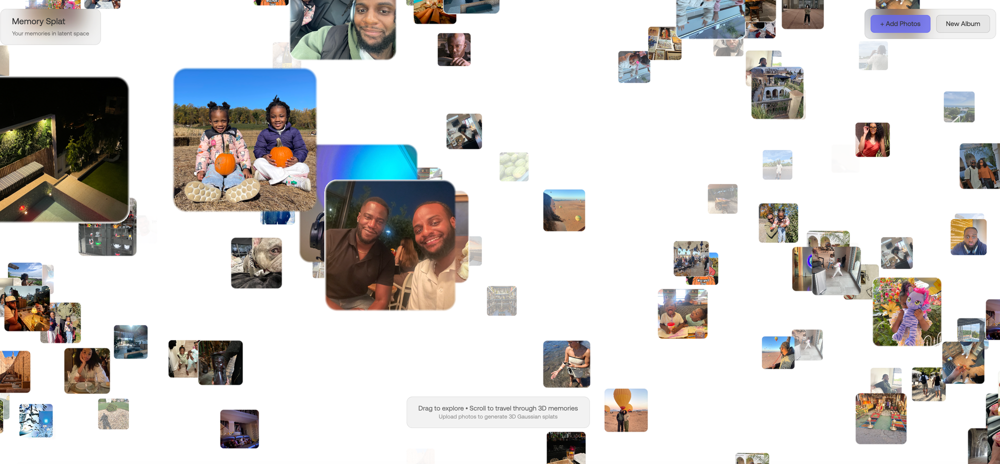

# Memory Visualizer



A web app that transforms your photos into 3D Gaussian splats. Upload your images and explore them as floating cards in 3D space - click any photo to view it as an interactive 3D splat.

## Features

- **3D Photo Gallery** - Photos float in 3D space as cards you can navigate through
- **On-demand Splat Generation** - Click a photo to convert it to a Gaussian splat via Sharp API
- **Interactive Navigation** - Drag to pan, scroll to move through depth
- **Splat Viewer** - Fullscreen 3D viewer with keyboard/button navigation between splats

## How It Works

1. Upload your photos (supports batch upload)
2. Photos appear as floating cards in 3D space
3. Drag to pan around, scroll to travel through the scene
4. Click any photo to generate and view its 3D Gaussian splat
5. Navigate between splats with arrow keys or on-screen buttons

## Tech Stack

- **Three.js** - 3D rendering and instanced mesh for photo cards
- **@mkkellogg/gaussian-splats-3d** - Gaussian splat visualization
- **Sharp API + Modal** - GPU-accelerated image-to-splat conversion
- **IndexedDB** - Local storage for photos and albums
- **Vite + TypeScript** - Build tooling

## Development

```bash
npm install
npm run dev
```

Open http://localhost:5173

## Project Structure

```
src/
├── main.ts          # App entry, upload handling, splat generation
├── canvas.ts        # Three.js scene, camera, raycasting
├── planes.ts        # Instanced mesh photo cards, texture atlas
├── splatViewer.ts   # Fullscreen Gaussian splat viewer
├── photoService.ts  # Photo/album management, IndexedDB
├── sharpService.ts  # Sharp API client for splat generation
└── shaders/         # Vertex/fragment shaders for photo cards
```

